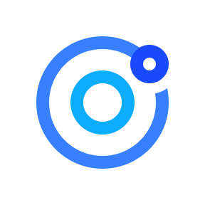

<!-- Improved compatibility of back to top link: See: https://github.com/othneildrew/Best-README-Template/pull/73 -->
<a id="readme-top"></a>

<!-- PROJECT LOGO -->
<br />
<div align="center">
  <a href="https://github.com/dafinrmaulana/icon-set-ionicons">
    
  </a>

  <h3 align="center">FREE IonIcons Figma Plugin</h3>

  <p align="center">
    a simple plugin for figma that created out of personal frustration due to icon set by icon duck
  </p>
</div>


<!-- ABOUT THE PROJECT -->
## About The Project

[![Plugin Preview][product-screenshot]]

Actually, there are a lot of better plugins out there, but because I'm lazy to look for other free plugins out there, I prefer to create my own plugin, so feel free to contribute and make this plugin even better :)

please note that this icon set comes from IonicTeam, thanks a lot to them for making this beautiful premium but free icon.

<p align="right">(<a href="#readme-top">back to top</a>)</p>


### Built With

*  <a href="https://tailwindcss.com">Tailwind CSS</a>
* <a href="https://ionic.io/ionicons">IonIcons</a>


<p align="right">(<a href="#readme-top">back to top</a>)</p>


<!-- GETTING STARTED -->
## Getting Started

Since this plugin has not been officially published yet, it needs to be imported locally in your figma.

### Clone this repo

make sure you have installed git (optional) and <a href="https://nodejs.org/en">Node JS</a> to do this installation.
* Clone with git
  ```sh
  git clone https://github.com/dafinrmaulana/icon-set-ionicons.git
  ```

* Download manually (Zip)
  <a href="https://github.com/dafinrmaulana/icon-set-ionicons/archive/refs/heads/main.zip">Click here</a>

### Installation

_keep in mind that you need to install <a href="https://nodejs.org/en">Node JS</a> first on your machine so that you can install the necessary packages later in this plugin._

1. Extract the downloaded file (if you manually download this plugin)
2. Go to the plugin directory ``/icon-set-ionicons``
3. Instal the necessary package by run this on your term
    ```sh
    npm install
    ```
3. Build the plugin with this command
    ```sh
    npm run build
    ```
4. Import the plugin

    


<p align="right">(<a href="#readme-top">back to top</a>)</p>


<!-- USAGE EXAMPLES -->
## Usage

Actually the way to use this plugin is the same as usual, but here is an example

  


<p align="right">(<a href="#readme-top">back to top</a>)</p>


<!-- MARKDOWN LINKS & IMAGES -->
<!-- https://www.markdownguide.org/basic-syntax/#reference-style-links -->
[contributors-shield]: https://img.shields.io/github/contributors/dafinrmaulana/icon-set-ionicons.svg?style=for-the-badge
[contributors-url]: https://github.com/dafinrmaulana/icon-set-ionicons/graphs/contributors
[forks-shield]: https://img.shields.io/github/forks/dafinrmaulana/icon-set-ionicons.svg?style=for-the-badge
[forks-url]: https://github.com/dafinrmaulana/icon-set-ionicons/network/members
[stars-shield]: https://img.shields.io/github/stars/dafinrmaulana/icon-set-ionicons.svg?style=for-the-badge
[stars-url]: https://github.com/dafinrmaulana/icon-set-ionicons/stargazers
[issues-shield]: https://img.shields.io/github/issues/dafinrmaulana/icon-set-ionicons.svg?style=for-the-badge
[issues-url]: https://github.com/dafinrmaulana/icon-set-ionicons/issues
[license-shield]: https://img.shields.io/github/license/dafinrmaulana/icon-set-ionicons.svg?style=for-the-badge
[license-url]: https://github.com/dafinrmaulana/icon-set-ionicons/blob/master/LICENSE.txt
[linkedin-shield]: https://img.shields.io/badge/-LinkedIn-black.svg?style=for-the-badge&logo=linkedin&colorB=555
[linkedin-url]: https://linkedin.com/in/othneildrew
[product-screenshot]: assets/preview.png
[Next.js]: https://img.shields.io/badge/next.js-000000?style=for-the-badge&logo=nextdotjs&logoColor=white
[Next-url]: https://nextjs.org/
[React.js]: https://img.shields.io/badge/React-20232A?style=for-the-badge&logo=react&logoColor=61DAFB
[Tailwind.css]: https://upload.wikimedia.org/wikipedia/commons/thumb/d/d5/Tailwind_CSS_Logo.svg/512px-Tailwind_CSS_Logo.svg.png?20230715030042

[React-url]: https://reactjs.org/
[Vue.js]: https://img.shields.io/badge/Vue.js-35495E?style=for-the-badge&logo=vuedotjs&logoColor=4FC08D
[Vue-url]: https://vuejs.org/
[Angular.io]: https://img.shields.io/badge/Angular-DD0031?style=for-the-badge&logo=angular&logoColor=white
[Angular-url]: https://angular.io/
[Svelte.dev]: https://img.shields.io/badge/Svelte-4A4A55?style=for-the-badge&logo=svelte&logoColor=FF3E00
[Svelte-url]: https://svelte.dev/
[Laravel.com]: https://img.shields.io/badge/Laravel-FF2D20?style=for-the-badge&logo=laravel&logoColor=white
[Laravel-url]: https://laravel.com
[Bootstrap.com]: https://img.shields.io/badge/Bootstrap-563D7C?style=for-the-badge&logo=bootstrap&logoColor=white
[Bootstrap-url]: https://getbootstrap.com
[JQuery.com]: https://img.shields.io/badge/jQuery-0769AD?style=for-the-badge&logo=jquery&logoColor=white
[JQuery-url]: https://jquery.com 
[Tailwindcss-url]: https://tailwindcss.com
[IonIcons-url]: https://ionic.io/ionicons
